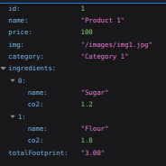
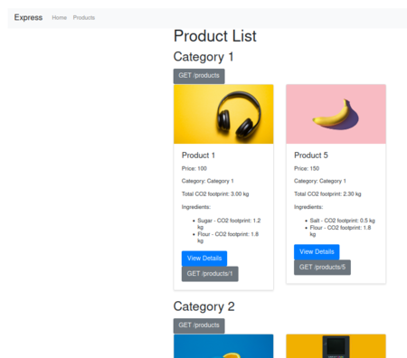
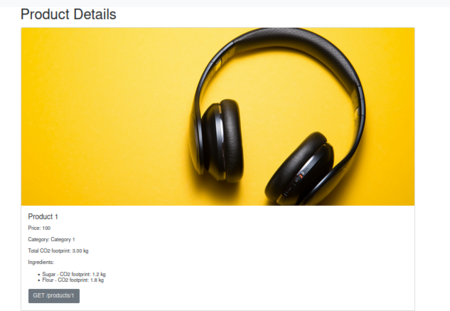

# Product Listing API

This project is a simple product listing application with two frontends (one JavaScript-based and one Jade-based) and a backend using Express. The frontends display a list of products and their details, while the backend provides the API endpoints to fetch the product data.

## Project Structure

- `frontend/`: Contains the JavaScript-based frontend code.
- `backend/`: Contains the backend code and Jade-based frontend.

## Screenshots

### API



### Product List



### Product Details



## Frontend

The frontend is a static website that fetches product data from the backend API and displays it.

### Files

- `index.html`: The main page that lists all products.
- `product.html?id={product_id}`: The page that displays details of a single product.
- `styles.css`: The stylesheet for the frontend.
- `script.js`: The main JavaScript file that handles fetching and displaying products.
- `config.js`: Configuration file for API endpoints.

### Setup

1. Ensure you have a web server to serve the HTML files.
2. Open `index.html` in your browser to view the product list.
3. Click on a product to view its details on `product.html`.

## Backend

The backend is a Node.js application using Express to serve API endpoints and render HTML pages using Jade templates.

### Files

- `app.js`: The main application file.
- `routes/index.js`: Defines the routes for the API.
- `views/`: Contains the Jade templates for rendering HTML.
- `public/`: Contains static files like stylesheets and images.
- `package.json`: Lists the dependencies and scripts for the backend.

### Setup

1. Install dependencies:

   ```bash
   npm install
   ```

2. Start the server:

   ```bash
   npm start
   ```

3. The server will run on `http://localhost:3000`.

## API Endpoints

- `GET /products`: Returns a list of all products.
- `GET /products/:id`: Returns details of a specific product by ID.
- `GET /products/view`: Renders the product list page.
- `GET /products/:id/view`: Renders the product details page.

## Dependencies

### Frontend

- Bootstrap 4.3.1 for styling.

### Backend

- Express: Web framework for Node.js.
- Jade: Template engine for rendering HTML.
- Morgan: HTTP request logger middleware.
- Cookie-parser: Middleware for parsing cookies.
- Debug: Debugging utility.
- Http-errors: Create HTTP errors for Express.
